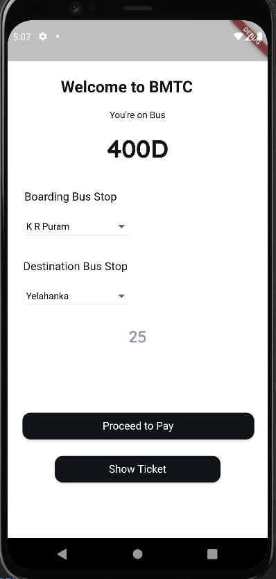
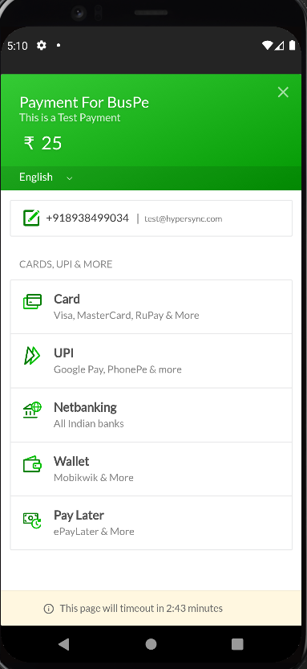
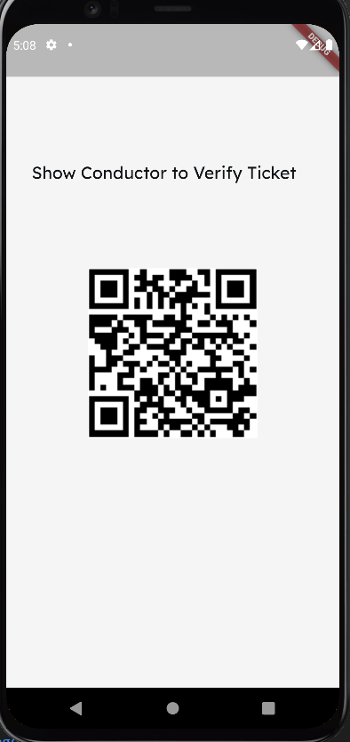
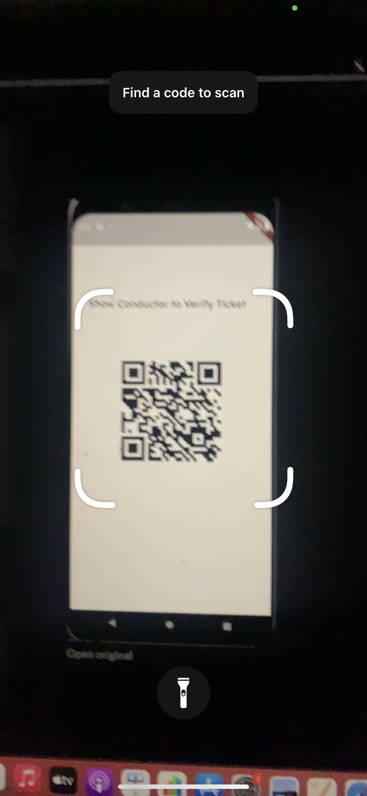

# BusPe
## Secure Pay on the go

- Paying with cash to buy tickets on the bus is a hassle for most people these days.
- With the rise of UPI and other cashless modes of payment, our project focuses on a web app payment for buses with an app that can be used by the conductor to verify the authenticity

# Modules :

- ### Customer App (Webapp/android/IOS) [demo Video](https://www.loom.com/embed/c6537f0a7a5047f7a9f77e381f264676)
  - The user who rides the bus can select the route using our drop down menus.
  - The interface automatically calculates the price of the route
  - When user clicks on Pay, it opens up the RazorPay portal to make the payment
  - After the payment is done, A show ticket button shows up. When that is clicked a QR Code is generated
  - This QR Code contains the payment Id fetched from the checkout API used to maek payment with RazorPay
  - The QR Code can be scanned by the Conductor to see if the ticket is genuine by validating the time stamps and the [payment id]
- ### Conductor App (Webapp/android/IOS) :
   - The conductor can scan the code that the user shows
   - When scanned, the razorpay's payments API route is used to fetch the necessary information 
     to validate the ticket and the timestamps.

- ### API Bridges Hosted on our deta cloud :
   - The api bridge takes input of our values from the mobile app and used the API keys that we have hidden in the cloud, so no data leak happens.
   - This prevents from reverse engineering our app and getting the API details
   - We have used FASTApi to achieve the same

## API Reference

#### Get all items

```http
  GET /payments/:id
```

| Parameter | Type     | Description                |
| :-------- | :------- | :------------------------- |
| `api_key` | `string` | **Required**. Your API key (in deta cloud, not exposed) |
| `api_secret` | `string` | **Required**. Your API Secret (in deta cloud, not exposed)|
| `Payment_id` | `string` | **Required**. The payment Id to be checked  |

Output : 
```json
{
    "status":"authorized",
    "createdAt":"2021-12-04 09:47:08"
}
```
#### Make an Order API

```http
  POST https://api.razorpay.com/v1/orders
```

| Parameter | Type     | Description                       |
| :-------- | :------- | :-------------------------------- |
| `api_key` | `string` | **Required**. Your API key (in deta cloud, not exposed) |
| `amount`      | `string` | **Required**. Amount of the purchase |
| `currency`      | `string` | **Required**. eg: INR,USD,etc |
| `receipt`      | `string` | **Required**. Receipt ID |
| `name`      | `string` | **Required**. Name of the order|


## Modules Pictures
- Customer Webapp to select routes and make the payment
-  
- The ticket is shown on the app which can be scanned by the conductor
-  


