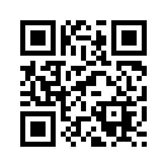
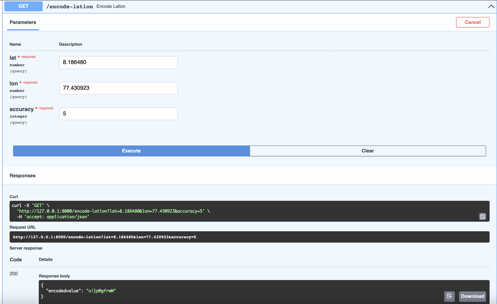
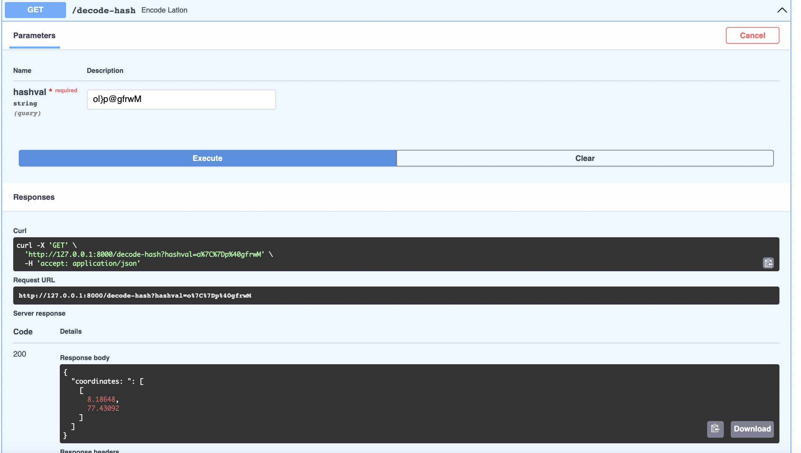
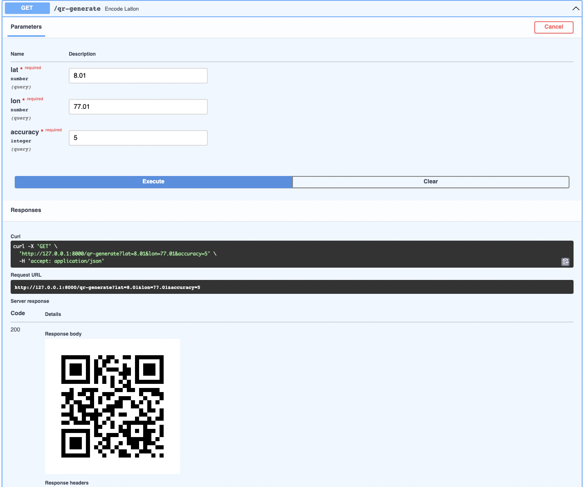

# Geo Hashing and QR Code Generation API using FastAPI (Python)
API to Hash Lattitude and Longitude into a single encrypted string using FastAPI, and convert it to QR Code for more portability. Hosting the API in a Deta Cloud environment.
## Features :
- #### Geo-coordinates to geohashed string
- #### Encode (lat,lon) to an encrypted string
- #### Decode the encrypted string back to coordinates
- #### Using Fast API, we can make API calls to convert any coordinates to string and decode it back.
- #### Inbuilt QR Code generation function, to convert encoded string to QR
- #### Hosted on Deta using CLI


# API Reference

## Encode / Geohashing of coordinates

```http
  GET /encode-latlon/
```

| Parameter | Type     | Description                |
| :-------- | :------- | :------------------------- |
| `lat` | `float` | **Required**. Your Latitude |
| `lon` | `float` | **Required**. Your Longitude |
| `accuracy` | `float` | **Required**. Accuracy from 1 to 10 |

### Example (Encode):
#### lat=8.186480, lon=77.430923, accuracy=5

#### Endpoint : http://127.0.0.1:8000/encode-latlon?lat=8.186480&lon=77.430923&accuracy=5

#### Output : 
```bash
{
  "encodedvalue": "o|}p@gfrwM"
}
```

## Decoding 

```http
  GET /decode-latlon/
```

| Parameter | Type     | Description                       |
| :-------- | :------- | :-------------------------------- |
| `hashval`      | `string` | **Required**. Encoded String |

### Example (Decode): 
#### lat=8.186480, lon=77.430923, accuracy=5

#### Endpoint : http://127.0.0.1:8000/decode-hash?hashval=o%7C%7Dp%40gfrwM

#### Output : 
```bash
{
  "coordinates: ": 
  [
    [
      8.18648,
      77.43092
    ]
  ]
}
```
## QR Code Generation 

```http
  GET /qr-generate/
```

| Parameter | Type     | Description                |
| :-------- | :------- | :------------------------- |
| `lat` | `float` | **Required**. Your Latitude |
| `lon` | `float` | **Required**. Your Longitude |
| `accuracy` | `float` | **Required**. Accuracy from 1 to 10 |

### Example (QR): 
#### lat=8.186480, lon=77.430923, accuracy=5

#### Output : 



  
## Deployment (Local)

### Install FastAPI and Uvicorn using PIP
- #### FastAPI
```bash
  $ pip install fastapi 
  [or]
  $ python -m pip install fastapi
```
- #### Uvicorn
```bash
  $ pip install uvicorn 
  [or]
  $ python -m pip install uvicorn
```

#### To deploy this project run

```bash
  $ uvicorn main:app --reload
```

 ## Deployment in Deta Cloud (Free)
 - #### Create a Deta account [here](https://web.deta.sh/)
 - #### Install Deta on terminal 
 ```bash
  $ curl -fsSL https://get.deta.dev/cli.sh | sh
 ```
 - In terminal navigate into the project folder and login using the Deta CLI 
 ```bash
  $ deta login
 ```
 - Create a micro instance in Deta using the following command, note down the endpoint and use it to make your API Calls
 ```bash
$ deta new --python any_name
 ```
 - Now navigate to the main.py created locally after you create the app, make the encessary changes to the file with the contents of your api file.
  ```bash
$ deta deploy
  ```
  - use this command to automatically deploy while making changes 
  ```zsh
  $ deta watch
  ```
 # Demo
 - ### Encode:

 
 
 - ### Decode:



 - ### QR Generation




 
